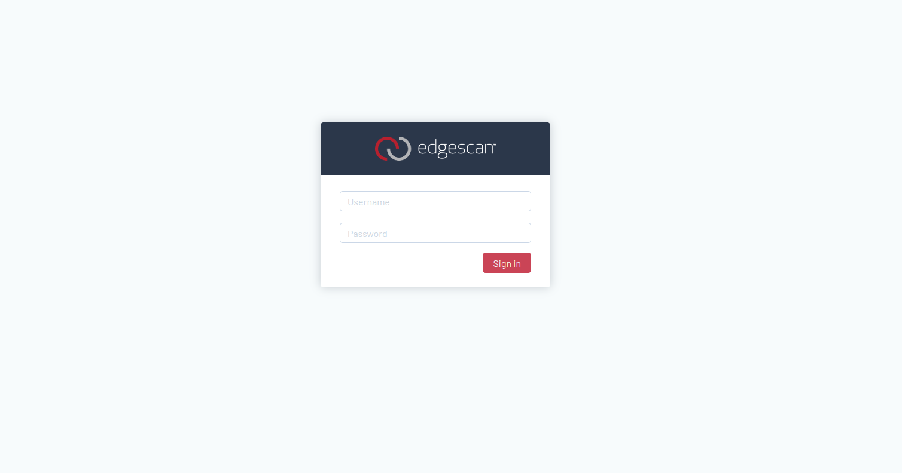

# Creating an API Token

Lorem ipsum dolor sit amet, consectetur adipiscing elit. Proin efficitur ipsum vitae ligula tristique, vitae dapibus mauris lacinia. Proin rhoncus aliquam nulla at pellentesque. Pellentesque interdum elementum maximus. Aenean tristique, nulla sed convallis blandit, massa elit dignissim ligula, eu aliquam mauris magna at diam. Integer in tellus ac risus suscipit rutrum sed et erat. In in elit porttitor, bibendum nisl eu, tincidunt lectus. Integer ac imperdiet nunc.

## Praesent a Lacinia Purus.

Praesent a lacinia purus. Duis viverra elit est, non consectetur risus imperdiet ut. Lorem ipsum dolor sit amet, consectetur adipiscing elit. Duis eget ultricies ex. Nam pharetra libero placerat, condimentum lorem vitae, bibendum sapien. Nam quis bibendum lorem. Ut at urna lacus. Quisque in nulla urna.

Integer posuere sem lorem, ac accumsan orci dapibus at. Donec volutpat orci turpis, id lacinia lorem auctor sit amet. Nulla finibus, nisl id mollis pretium, nulla magna eleifend leo, a sagittis neque dui at lectus. Curabitur eleifend, justo sed venenatis sagittis, sem ex iaculis diam, non facilisis tellus ipsum ut nulla. Curabitur erat risus, congue eu ligula vel, eleifend pharetra metus. Suspendisse odio ex, pharetra in feugiat id, luctus sed ante. Duis rutrum diam vel semper tincidunt. Nullam in gravida turpis. Fusce et tincidunt dui. Quisque tincidunt, justo quis vehicula maximus, enim quam laoreet nisl, quis vestibulum ligula mi sit amet sem. Mauris id velit at odio tincidunt semper. Sed non convallis leo.

## Mauris Quis

Mauris quis viverra mauris, non eleifend augue. Donec commodo vestibulum risus nec volutpat. Vestibulum urna sapien, placerat ut purus vitae, aliquam tincidunt augue. Etiam vitae velit sodales, posuere urna ut, sodales magna. Nam et iaculis sem. Curabitur eu odio vehicula, tempus sem id, mollis purus. Aliquam ut risus a libero mattis hendrerit. Sed sit amet sollicitudin tellus.

Phasellus maximus, nulla ac suscipit pellentesque, magna nisi sodales mi, sit amet convallis est eros tempus quam. Fusce nec sollicitudin velit. Cras diam nisi, consequat quis tempor in, tristique eget neque. Aliquam ultrices rutrum suscipit. Suspendisse malesuada, massa eget scelerisque lobortis, lectus ligula accumsan nunc, eu tempor massa purus in augue. Morbi at gravida eros. Cras lobortis neque at viverra tincidunt. Nulla finibus gravida elementum. Praesent feugiat pretium metus, ac pellentesque nisi ullamcorper at. Quisque cursus efficitur commodo. Fusce rutrum eros enim, sit amet scelerisque lectus dapibus vel. Donec porttitor eu neque eu ultrices. Suspendisse maximus imperdiet ipsum, at rhoncus lacus dignissim quis. Etiam metus justo, consequat id imperdiet et, sodales a eros.

## Next Steps

Learn more about the basics of the api <a data-reference="api_guide:authenticating:api_tokens">here</a>
